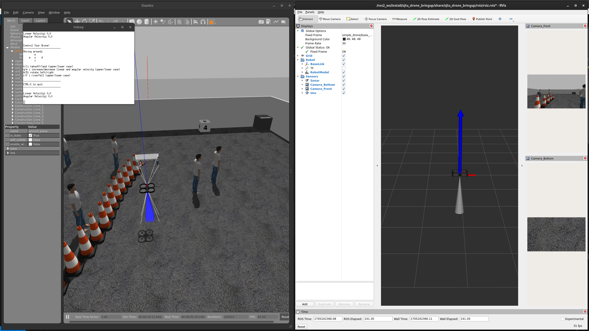
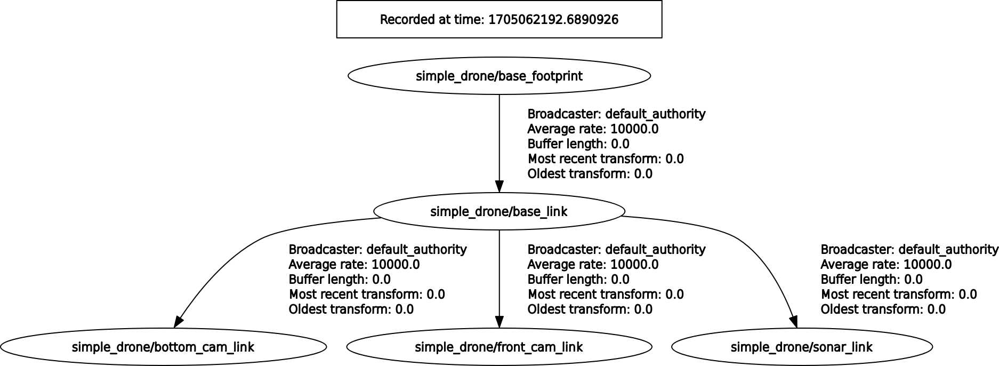
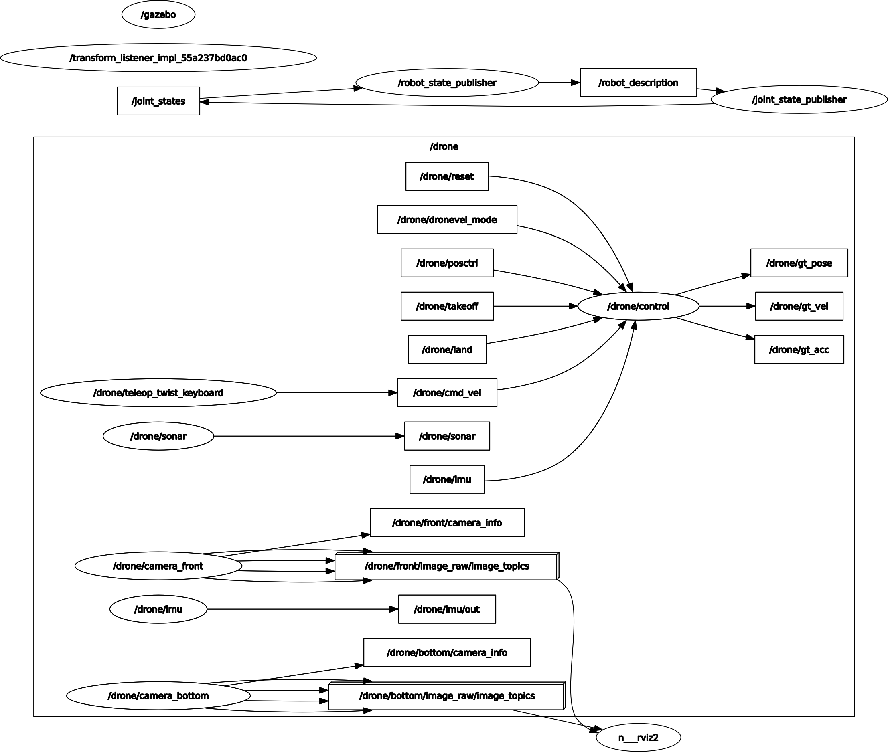

# FALCO Drone ROS 2 Environment

A comprehensive ROS 2 simulation environment for the FALCO drone using Gazebo 11, featuring advanced PID control systems and high-level position control capabilities.

## Table of Contents

- [Introduction](#introduction)
- [Prerequisites](#prerequisites)
- [Setup](#setup)
- [Usage](#usage)
- [Control System Details](#control-system-details)
- [Real Time System](#real-time-system)
- [Configuration](#configuration)
- [Troubleshooting](#troubleshooting)
- [Additional Information](#additional-information)

## Introduction

This repository provides a complete simulation environment for the FALCO drone built on ROS 2 Humble and Gazebo 11. The simulation includes:

- Realistic drone physics and dynamics
- PID-based flight control system
- High-level position control interface
- Sensor simulation with noise modeling
- Safety mechanisms for autonomous operation



### System Architecture

The system uses a well-defined transform tree for accurate positioning and control:



## Prerequisites

Before running the simulation, ensure you have:

- Docker installed on your system
- Basic knowledge of ROS 2 and Gazebo
- Terminal access with bash support

## Setup

### 1. Build the Docker Environment

First, build the updated Docker image with all required packages:

```bash
cd Ros-2-Environment/ros2_env/docker
./build.sh
```

### 2. Run the Docker Container

After building, start the Docker container:

```bash
cd Ros-2-Environment/ros2_env/docker/
./start_integrated.sh
```

### 3. Install tmux (Optional but Recommended)

> **Note:** tmux needs to be installed each time you run the container due to the current Dockerfile configuration.

```bash
cd ros2_ws/
sudo apt-get update
sudo apt install tmux
```

## Usage

### 1. Build and Launch the Simulation

In a new tmux session, build the workspace and launch the simulation:

```bash
# Build the ROS 2 workspace
colcon build

# Source the environment (execute inside ros2_ws folder)
source install/setup.bash

# Launch the drone simulation with Gazebo
ros2 launch falco_drone_bringup falco_drone_bringup.launch.py
```

### 2. Run Position Control

In a new tmux session, start the position control node:

```bash
# Source the environment
source install/setup.bash

# Run the position control node
ros2 run falco_drone_control drone_position_control
```

The `drone_position_control` node enables closed-loop pose and velocity control for reaching target positions through the `self.move_drone_to_pose(...)` method.

### 3. Publish the button topic
Publish an integer message for letting the drone to take off
```bash
ros2 topic pub /start_button std_msgs/msg/Int8 "data: 1" --once
```

## Control System Details

The FALCO drone uses a sophisticated control system implemented through Gazebo plugins. The main control components are located in `ros2_env/ros2_ws/src/falco_drone/falco_drone_description/`.



### PID Control Plugin (`plugin_drone_private.cpp`)

The core control system handles:

- **Parameter Loading**: Reads PID parameters from the SDF file
- **Sensor Callbacks**: Processes sensor data, cmd_vel, and pose data with noise modeling
- **State Management**: Handles takeoff, landing, and flight state operations
- **Odometry Publishing**: Publishes drone state as `nav_msgs/Odometry` messages in the `base_footprint` frame
- **TF Publishing**: Maintains the transform tree for visualization in Gazebo
- **State Updates**: Manages drone state transitions (flying, landing, taking off)
- **Dynamics Updates**: Applies PID control outputs to drone motors for desired flight behavior

### High-Level Control (`drone_position_control.py`)

The position control node provides:

- High-level position control interface
- Target position management
- **Safety Features**: Automatic landing mechanism when close to target altitude
- Landing timer (`self.landing_timer`) for safe altitude proximity operations

> **Safety Note:** The landing timer triggers automatically when the drone's vertical distance to the ground is close to the target altitude.

## Real Time System
Currently not implemented yet, but the idea is to integrate ros topics feedbacks to the **Teensy 4.1** serial port.

## Configuration

### Modifying Drone Parameters

To customize drone parameters (mass, inertia, etc.):

1. **Edit the XACRO file**:
   ```bash
   # Navigate to the URDF directory
   cd ros2_env/ros2_ws/src/falco_drone/falco_drone_description/urdf/
   
   # Edit the drone parameters
   nano falco_drone.urdf.xacro
   ```

2. **Generate updated URDF**:
   ```bash
   # Generate new URDF file
   ros2 run xacro xacro falco_drone.urdf.xacro > falco_drone.urdf
   ```

3. **Generate updated SDF**:
   ```bash
   # Navigate to the models directory
   cd ../models/falco_drone/
   
   # Generate new SDF file
   gz sdf -p ../../urdf/falco_drone.urdf > falco_drone.sdf
   ```

> **Important:** Both URDF and SDF files must be regenerated after modifying the XACRO file to ensure changes take effect.

## Troubleshooting

### Common Issues

1. **Container Access Issues**: Ensure Docker is properly installed and running
2. **Build Failures**: Check that all dependencies are correctly installed in the Docker image
3. **Gazebo Models Missing**: The simulation requires Gazebo models to be downloaded (see package-specific README)
4. **tmux Not Available**: Remember to install tmux each time you start a new container

### Getting Gazebo Models

If you encounter missing Gazebo models, install them with:

```bash
curl -L https://github.com/osrf/gazebo_models/archive/refs/heads/master.zip -o /tmp/gazebo_models.zip \
    && unzip /tmp/gazebo_models.zip -d /tmp && mkdir -p ~/.gazebo/models/ && mv /tmp/gazebo_models-master/* ~/.gazebo/models/ \
    && rm -r /tmp/gazebo_models.zip
```

## Additional Information

### Package Structure

- **falco_drone_description**: Contains drone models, plugins, and world files
- **falco_drone_bringup**: Launch files and configuration
- **falco_drone_control**: Control nodes and algorithms

### Development Notes

- The current Dockerfile setup requires tmux to be installed manually each session
- Consider adding tmux to the Dockerfile for persistent installation
- All paths in this documentation use relative references from the repository root

For more detailed information about specific packages, refer to their individual README files in the respective package directories.
